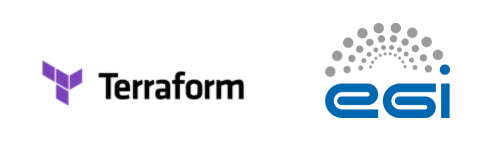

# Using Terraform on the Fedcloud infrastructure




Terraform can be used to manage your infrastructure in the EGI Federated Cloud, but it requires a few configuration steps. This guide explains two methods:
- [Using fedcloud-tf](./README.md#using-fedcloud-tf). For convenience, a script called [**fedcloud-tf**](fedcloud-tf) has been created, which is all that is needed to use Terraform on Fedcloud. This script has been prepared to be used on Ubuntu.
- [Manual configuration](./README.md#manual-configuration). Alternatively, the necessary steps required to manually configure the environment are described below.

[Other useful commands](./README.md#other-useful-commands) are described at the end of this document.

Note that the management of Fedcloud infrastructure requires authentication via [EGI Check-in](https://docs.egi.eu/users/aai/check-in/).

---

## Using fedcloud-tf

```
    .d888              888          888                        888        888     .d888 
   d88P"               888          888                        888        888    d88P"  
   888                 888          888                        888        888    888    
   888888 .d88b.   .d88888  .d8888b 888  .d88b.  888  888  .d88888        888888 888888 
   888   d8P  Y8b d88" 888 d88P"    888 d88""88b 888  888 d88" 888        888    888    
   888   88888888 888  888 888      888 888  888 888  888 888  888 888888 888    888    
   888   Y8b.     Y88b 888 Y88b.    888 Y88..88P Y88b 888 Y88b 888        Y88b.  888    
   888    "Y8888   "Y88888  "Y8888P 888  "Y88P"   "Y88888  "Y88888         "Y888 888    
```
The script can be downloaded from this repository. Just assign it execution permissions and run it. This script will help you to do all necessary tasks to configure Terraform access to the providers. Run the script with no parameters to obtain **_help_** information. 

The usual steps are:

### 0. Requirements
The script needs Python 3 installed, an apt-based system such as Ubuntu, and Bash 4 or newer.
It has been tested on _Ubuntu 21.10_ and _Terraform v1.1.7_.

### 1. Installation
Run:

`./fedcloud-tf install`

This will install [oidc-agent](https://github.com/indigo-dc/oidc-agent), [fedcloudclient](https://fedcloudclient.fedcloud.eu/), pip and Openstack Python client.
Before installing any of these packages, you will be asked for confirmation:

```console
Installing oidc-agent...
  > oidc-agent will be installed. Continue? ('no' will skip) [y/n]:
```

The installation of oidc-agent will open a Web browser for you to login via [EGI Check-in](https://docs.egi.eu/users/aai/check-in/). You will be asked to provide a password to protect your credentials.
This step has to be done only once.

### 2. Listing available sites (providers) and VOs
Run:

`./fedcloud-tf list`

This will list sites and VOs available for you. This command is only necessary if you do not know the names of the site and VO you will use to manage your infrastructure.

Example:
```console
i@tckr:~$ ./fedcloud-tf list
VO                   id                                Name                 enabled    site
-------------------  --------------------------------  -------------------  ---------  ----------------
vo.access.egi.eu     995cb1ff4684a536a15ebb338af69460  VO:vo.access.egi.eu  True       IFNET-LCG2
training.egi.eu      f18880134d04536a964097524eace710  VO:training.egi.eu   True       IFNET-LCG2
vo.access.egi.eu     3a8e179d66e64005bf19b536adf7743d  vo.access.egi.eu     True       CESILM
vo.nextgeoss.eu      b1d2ef2cc2281157bcde21cf4ab141e3  vo.nextgeoss.eu      True       CESILM
vo.notebooks.egi.eu  fcaf211c536a405694e7494a59ee5f09  vo.notebooks.egi.eu  True       CESILM
```
So, for example, the site `CESILM` and the VO `vo.access.egi.eu` can be used.


### 3. Obtain the list of available resources
Run:

`./fedcloud-tf resources <site> <vo>`

This command requires the site and VO names, which were obtained in the previous step (**_list_** argument).
The **_resources_** argument will create a file in the current directory with Terraform variables with all images and flavours available at the provider. Such file will look like:

```terraform
locals {
  img-2fd37 = "2d22ecb3b-4467-801a-a668214830c" # Image for EGI Docker [Ubuntu/18.04/VirtualBox]
  img-4ee18 = "d313660ef-371a-ac51-0e151830c40" # Image for CernVM4 [CentOS/7/OpenstackRAW]
  img-d2fe0 = "c03de8720-d88a-4939232830c489b8" # Image for CernVM4 [CentOS/7/QEMU-KVM]
  img-1f4d1 = "1000afdbf-4f4e-a34f-7fd18f27283" # Image for EGI CentOS 8 [CentOS/8/VirtualBox]
  ...
  flv-1c243 = "1" # m1.tiny [CPU] 1 [RAM] 512 [DISK] 0
  flv-a62b3 = "2" # m1.small [CPU] 1 [RAM] 2000 [DISK] 10
  ...
```

Image IDs are prefixed with **_img_** whereas flavour IDs are prefixed with **_flv_**.

You can reference the corresponding IDs (e.g. `img-2fd37`) from your Terraform files.


### 4. Run Terraform
In general terms, this is the only step that has to be performed routinely, the rest can be part of the intial setup. Once your Terraform scripts have the reference to the IDs you wish to use, there are two options:

**Option A)**

Run:

```
eval `./fedcloud-tf setup <site> <vo>`
```

This will setup the necessary access token for the provider in an environment variable. Afterwards, you can run your Terraform commands as usual: terraform apply, etc.
Note that, normally, the requested token will last for one hour, so if you run Terraform after this time it will be necessary to run the `eval` command above again.

**Option B)**

Run:

```
./fedcloud-tf tf <site> <vo> <Terraform_parameters>
```

This runs the Terraform command directly with all parameters specified after the VO. It will setup the necessary access token for the provider only for the time this command   is run. For example: ` ./fedcloud-tf tf CESILM vo.access.egi.eu apply -var-file="testing.tfvars"`.

### 5. Functionality under consideration

- The script does not use [Python Virtual Environments](https://docs.python.org/3/library/venv.html), which might be desired in some situations.
- The script does not install [IGTF certificates](https://github.com/tdviet/python-requests-bundle-certs/blob/main/scripts/install_egi_core_trust_anchor.sh), which are necessary to access some providers. A robust solution is being studied, so please contact the author if this is needed.

### 6. Need more help?

An example of a simple `main.tf` [is provided](example/main.tf).

To display the help, run:

```
./fedcloud-tf
```


```console
i@tckr:~$ chmod a+x fedcloud-tf 
i@tckr:~$ ./fedcloud-tf


    .d888              888          888                        888        888     .d888 
   d88P"               888          888                        888        888    d88P"  
   888                 888          888                        888        888    888    
   888888 .d88b.   .d88888  .d8888b 888  .d88b.  888  888  .d88888        888888 888888 
   888   d8P  Y8b d88" 888 d88P"    888 d88""88b 888  888 d88" 888        888    888    
   888   88888888 888  888 888      888 888  888 888  888 888  888 888888 888    888    
   888   Y8b.     Y88b 888 Y88b.    888 Y88..88P Y88b 888 Y88b 888        Y88b.  888    
   888    "Y8888   "Y88888  "Y8888P 888  "Y88P"   "Y88888  "Y88888         "Y888 888    


                                  =============
                                   FEDCLOUD-TF
                                  =============
               Script to support Terraform use on Fedcloud infrastructure


 Version: 22MAR-03
 Contact: EGI Foundation.


 Arguments
 ---------

 install                 Installs the software needed to use Terraform in the EGI
                         infrastructure. This installation consists of OIDC-agent
                         and Fedcloud. 
                         OIDC-agent will require you to log in into your Check-in
                         account (this is a one-time process).
                         To install Fedcloud you will need to have Python already
                         installed.


 list                    Lists the providers and VOs available for the user.


 resources <site> <vo>   Creates a file of Terraform variables containing all possible
                         images and flavours available for use at the specified provider.
                         Note that the file is named after the site and vo and is
                         overwritten if it exists.


 setup <site> <vo>       Outputs the export of variables "OS_AUTH_URL" and "OS_TOKEN"
                         containing the provider endpoint and a requested token.
                         This should normally be used with eval (see example below).


 tf <site> <vo> *        Configures the endpoint and token and runs terraform with any
                         argument supplied after the <vo> argument (see example below).


 Operation
 ---------
 The usual way to use this script is:
 - Run "./fedcloud-tf install" to have all components installed. This has to be done only once.
 - Run "./fedcloud-tf list" anytime you need to see which providers and VOs you can use.
   Once you know the site name and VO name you do not need to run this command again.
 - With the site and VO names, run "./fedcloud-tf resources <site> <vo>" to have a file with
   Terraform variables created for you. Open this file and obtain the IDs that you
   wish to use in your Terraform scripts. You only need to run this command again
   if the site has new or updated images or if you want to access another site or VO.
   Note that all these variable files will be automatically loaded by Terraform if they
   are in your current directory.
 - To run Terraform, you have two options:
   a) Run "eval `./fedcloud-tf setup <site> <vo>`" first and then run your Terraform commands
      as usual. The eval command requests an access token that is normally valid for one hour,
      so it will have to be run again anytime you use Terraform and the token is expired.
   b) Run Terraform through "./fedcloud-tf tf <site> <vo> <Terraform_parameters>". This automatically
      requests a new access token every time and calls terraform with any parameter supplied.


 Usage examples
 ---------------
 ./fedcloud-tf install
 Installs the required components

 ./fedcloud-tf list
 Outputs the list of providers and VOs available for your user

 ./fedcloud-tf resources PROV vo.access.egi.eu
 Generates the file "PROV-vo.access.egi.eu.tf" (overwriting contents!)
 containing Terraform variables for a specific provider, which can be
 referenced from your Terraform files.

 eval `./fedcloud-tf setup PROV vo.access.egi.eu`
 Configures the access to a provider with the environment variables
 "OS_AUTH_URL" and "OS_TOKEN" used by Terraform. After this,
 you can run your Terraform commands as usual.
 This command requests a token that will typically last for 1h.
 The command will have to be run again if the token is expired.

 ./fedcloud-tf tf PROV vo.access.egi.eu apply
 Runs a terraform apply, after requesting a token from a provider.
 This is an alternative to using the "./fedcloud-tf setup" command, as it
 basically runs a setup command internally and then calls the
 "terraform" command with any additional parameters.

 ./fedcloud-tf tf PROV vo.access.egi.eu apply -var-file="testing.tfvars"
 Runs a terraform apply -var-file="testing.tfvars".

```

---

## Manual configuration

The installation steps must be run only once.

### 1. Install OIDC-agent
As explained in the [oidc-agent documentation](https://github.com/indigo-dc/oidc-agent).


### 2. Configure OIDC-agent
```
eval `oidc-keychain`
oidc-gen --pub --issuer https://aai.egi.eu/oidc \
	    		 --scope "email \
	             eduperson_entitlement \
	             eduperson_scoped_affiliation \
	             eduperson_unique_id" egi
export OIDC_AGENT_ACCOUNT=egi
```

### 3. Install Fedcloudclient
As explained in the [fedcloudclient documentation](https://fedcloudclient.fedcloud.eu/install.html).

NOTE: By default, `fedcloud` executable might be installed in `~/.local/bin/fedcloud` by pip.

Fedcloudclient can be easily run via Docker too:
```
docker run --rm -it -v ~/.config/oidc-agent/egi:/root/.config/oidc-agent/egi tdviet/fedcloudclient bash
[In container] eval `oidc-keychain --accounts egi` && export OIDC_AGENT_ACCOUNT=egi
```

### 4. Install the Openstack client
As explained in [Openstack documentation](https://docs.openstack.org/mitaka/user-guide/common/cli_install_openstack_command_line_clients.html).

Ubuntu has apt packages available (see the ["Client installation" section](https://docs.openstack.org/install-guide/environment-packages-ubuntu.html)).


### 5. Obtain the list of providers and VOs available
```
fedcloud endpoint vos -a
```
This provides the official names of the site and the VO in which the infrastructure will be managed with Terraform.


### 6. Obtain the provider endpoint
```
fedcloud endpoint list --site <site>
```
The endpoint is necessary for Terraform [**auth_url** attribute](https://registry.terraform.io/providers/terraform-provider-openstack/openstack/latest/docs#auth_url).

### 7. Obtain the list of images and flavours available
```
fedcloud openstack image list --site <site> --vo <vo>
fedcloud openstack flavor list --site <site> --vo <vo>
```
OR:
```
fedcloud select image --image-specs Name --site <site> --vo <vo>
fedcloud select flavor --flavor-specs Name --site <site> --vo <vo>
```

This will give the IDs that have to be used inside Terraform scripts.

### 8. Obtain an access token from the provider
```
fedcloud openstack --site <site> --vo <vo> token issue -c id -f value
```
The token is necessary for Terraform [**token** attribute](https://registry.terraform.io/providers/terraform-provider-openstack/openstack/latest/docs#token).

### 9. Configure and run Terraform as usual
Finally, Terraform can be called with all the information obtained from the commands described above:
- Site endpoint
- Site access token
- Image and flavour IDs

Note that only Steps (8) and (9) will have to be conducted on regular basis.

## Other useful commands

### List OIDC accounts
`oidc-add -l`

### Check token
`oidc-token --env`

### Check token expiry time
```
fedcloud token check --oidc-access-token `oidc-token egi`
```
OR:
```
printf '%(%F %T)T\n' `oidc-token --env $OIDC_AGENT_ACCOUNT | grep -oP '(?<=OIDC_EXP=).*?(?=;)'` )
```

### Renew refresh token (which expires every 13 months)
`oidc-gen egi --reauthenticate`


